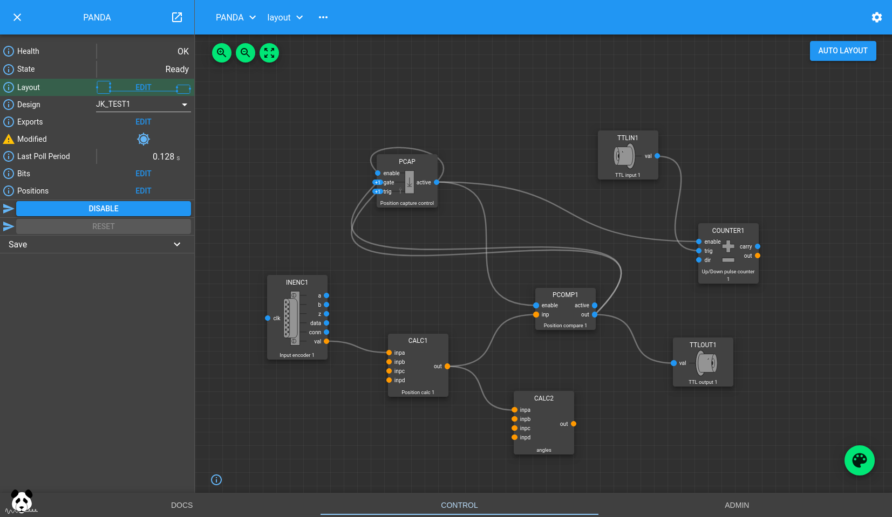

# TOMO setup

## Conda environment

`/home/xf27id1/conda_envs/2024-1.0-py310-tiled-dev` on `xf27id1-ws2` machine.


### Source-installed repositories

- `ophyd-async`: https://github.com/NSLS-II-TST/ophyd-async/tree/add-vimba-support (based on the https://github.com/bluesky/ophyd-async/pull/154 PR branch)
- `bluesky`: https://github.com/genematx/bluesky/tree/add-tiled-writer and https://github.com/bluesky/bluesky/pull/1660
- `tiled`: https://github.com/danielballan/tiled/tree/register-hdf5-internal (merged https://github.com/bluesky/tiled/pull/687)


## Tiled configuration

Runs locally on `xf27id1-ws2` machine. Check it with:

```bash
$ systemctl status tiled
```


## Prefect configuration

- https://github.com/NSLS-II-HEX/workflows/tree/export-nxs and https://github.com/NSLS-II-HEX/workflows/pull/4


## PandA IOC

- The IOC runs on `xf27id1-ioc1` (Panda 1)
- Source from https://github.com/PandABlocks/PandABlocks-ioc/pull/102 (https://github.com/jwlodek/PandABlocks-ioc/tree/add-create-dir-depth)


## PandA configuration

http://xf27id1-panda1.nsls2.bnl.local:8008/gui/PANDA/layout/

